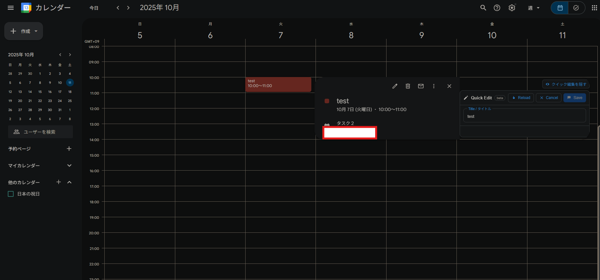

# GCal Popup Editor（Chrome拡張）

Googleカレンダーの小さいポップアップから、イベントの「タイトル」だけを素早く編集し、公式UIを自動操作して保存する拡張です（APIやOAuthは不要）。

## つくった動機
- 自分的な悩みとして、「スケジュール単体を全画面で開かないと編集できない」のがストレスでした。そこで、ポップアップ内で完結して編集・保存できるようにするために作りました。

## 主な機能
- イベントのクイックポップアップを検知して、下部に「クイック編集」カード（タイトルのみ）を表示。
- 保存時は、拡張が公式UIを自動操作：ポップアップの「編集」→ フル編集画面のタイトル欄へ反映 → 保存ボタンをクリック。
- API非使用・OAuth不要。ユーザーの既存ログイン状態を利用。
- 表示/非表示トグルボタン付き（「クイック編集を隠す/表示」）。
- キーボードショートカット: Ctrl/Cmd+S（保存）、Esc（キャンセル）、Alt+R（ポップアップから再読込）。
- 保存後のスクロール位置維持: 保存処理の前にスクロール位置をスナップショットし、保存完了後に復元します。
- 読み込み完了トリガーで復帰: 保存後、カレンダーの読み込み（描画）が静穏状態になったタイミングで、保存前の表示（日付/ビュー）へ戻ります。
- URLスナップショット＆復帰: まずソフト復帰（`history.replaceState`）を試み、異なる場合のみハード復帰（`location.assign`）で保存前URLへ戻ります。ハード復帰時は `sessionStorage` を用いてスクロール位置も確実に復元します。
- 送信ダイアログの自動処理: 「更新を送信しますか？」等のダイアログが表示された場合は自動で「送信」を選択（既定）。

## インストール（アンパック）
1. Chromeで `chrome://extensions` を開く
2. デベロッパーモードをオン
3. 「パッケージ化されていない拡張機能を読み込む」でこのフォルダを選択
4. `https://calendar.google.com/` を開き、イベントをクリック

## 使い方
- イベントポップアップ下部に「Quick Edit」カードが表示されます。
- タイトルを編集して「Save」を押す（または Ctrl/Cmd+S）。
- 一瞬フル編集画面が開いてタイトルが書き換わり、自動で保存→閉じます。
- カレンダーの読み込みが落ち着いたタイミングで、保存前のURL/位置に戻ります（表示が“今日”へ飛ぶのを防止）。
- 右上の「クイック編集を隠す」ボタンでカードを一時的に非表示にできます（再度押すと表示）。

## 注意点
- GoogleカレンダーはDOMやaria-labelが変更されることがあります。動作しなくなった場合は `src/content.js` のセレクタやラベルを調整してください。
- 本拡張はブラウザ上のDOM自動操作のみを行い、Google Calendar APIは呼び出しません。
- UI言語（日/英）に応じて一般的なラベルを幅広く判定していますが、環境によって合わない場合があります。
- 送信ダイアログの既定は「送信」です。ゲスト通知を送りたくない場合は実装を「送信しない」に切り替えることも可能です（要コード変更）。

## 権限
- `activeTab`, `scripting`, `storage`, `tabs`
- ホスト権限: `https://calendar.google.com/*`

## 開発メモ
- 本体ロジック: `src/content.js`
- スタイル: `src/content.css`

## 既知の制限
- 現状、編集対象は「タイトル」のみです（説明欄はUIから撤去）。
- Google側のUI変更やA/Bテストにより、自動操作が失敗する場合があります（ラベル/セレクタ更新で対応）。
- 一部の表示モードや環境では、保存直後にカレンダーが“今日”へジャンプする動作が強い場合があります。その際はハード復帰＋スクロール復元でケアしていますが、まれに数百msのラグが発生します。

## 実装メモ（復帰ロジックの詳細）
- ルート復帰:
  - 保存前に `pathname + search + hash` を記録。
  - 保存後は「読み込み静穏」(短時間DOMに大きな変化がない・プログレス/ダイアログなし) を検知してから復帰。
  - 現在URLが同じなら何もしない。異なる場合はまずソフト復帰、だめなら `sessionStorage` にスクロール情報を保存してからハード復帰。
- スクロール復元:
  - カレンダーのメインスクロール要素（ヒューリスティックで選定）と `window` 座標をスナップショットして復元。
  - 復元直後は短時間の“スクロールロック”で自動スクロールを打ち消し、同じ位置を維持。
